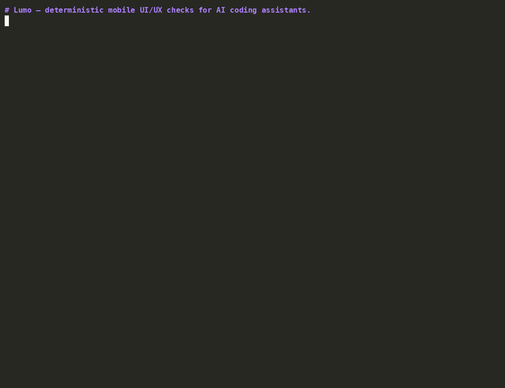

# Lumo

> Mobile UI/UX design intelligence for AI coding assistants, grounded in
> cognitive science — not just style guides.

**Status:** v0.0.8 published (alpha — PyPI and npm versions stay in lock-
step). Seven tools work (`lumo-wcag`, `lumo-theory`, `lumo-parity`,
`lumo-source`, `lumo-audit`, `lumo-figma`, plus the `lumo-mcp` server),
five install paths are live (`npx @onexeor/lumo init` · `npx skills add`
· Claude plugin marketplace · `pipx install lumo-mobile` · git clone),
and the MCP server exposes eight functions to every major AI client.

Lumo helps mobile developers build polished, accessible UI by applying
**Fitts**, **Hick**, **Gestalt**, and **Nielsen** alongside Apple HIG and
Material Design. The hard checks (WCAG luminance, OKLCH correction,
cross-platform diff) run as **deterministic Python tools**, not LLM
guesses.

## What works today

| Tool | What it does |
|---|---|
| `lumo-wcag` | WCAG AA / AAA contrast checker + OKLCH auto-correct that preserves chroma and hue. Catches the contrast pairs Claude misjudges by eye. |
| `lumo-theory` | Cognitive-science layout checks: undersized tap targets, relative Fitts difficulty for primary actions, Hick overload in equal-weight choice groups, Gestalt proximity violations, one-handed reachability. |
| `lumo-parity` | Cross-platform diff between Android (Compose / XML, in dp) and iOS (SwiftUI / UIKit, in pt). Flags size and component mismatches. Whitelists known platform divergences (Material 48 dp vs Apple HIG 44 pt, etc.) so the noise stays out. Optional `lumo.config.json` validates both platforms against shared design tokens. |
| `lumo-source` | AST-based design-system drift checks for Jetpack Compose `.kt` and SwiftUI `.swift` files. Flags hardcoded colours, off-scale paddings / radii, and undersized tap targets (Material 48dp on Compose, Apple HIG 44pt on SwiftUI) — but never trips on theme tokens (`MaterialTheme.*`, `LocalDimensions.*`, `Color("brand…")`, asset-catalog lookups) since those are exactly what Lumo wants to encourage. |
| `lumo-audit` | Whole-repository scan. Walks every `.kt` / `.swift` file, aggregates `lumo-source` findings, and surfaces the *measured* spacing / radius scale — the actual frequency of every hardcoded literal in the codebase. Lets you compare what your design system claims against what the code actually does. |
| `lumo-figma` | Diff Figma design tokens (COLOR + FLOAT variables) against the audited code. Matches by value, not name. Three buckets: matched, unused-in-code (candidates for review), and missing-from-Figma (heavy code values waiting to be promoted to the design system). |
| `lumo-mcp` | Model Context Protocol server. Exposes all of the above to Claude Code, Cursor, Continue, Aider, Goose, Zed, OpenAI Codex CLI, and any other MCP-aware client. |

Each tool returns structured findings (severity, recommendation, metric)
and propagates an honest confidence label — `measured`, `code-estimated`,
or `description-estimated` — so the consumer can weigh the result.

## Demo



Real output from the Lumo CLIs, no screenshots or hand edits. Rebuild
locally with `bash assets/record-demo.sh` after a `pip install -e ".[dev]"`
in `tools/` and `brew install asciinema agg`. (The GIF currently shows
`lumo-wcag`, `lumo-parity`, and `lumo-theory` — `lumo-source` is captured
in the worked examples below the install section instead.)

### WCAG auto-correct in OKLCH (preserves brand chroma and hue)

```
$ lumo-wcag fix --fg '#7DD3FC' --bg '#FFFFFF'
FIXED  #7DD3FC → #1B7BA1  on #FFFFFF
       ratio 1.667:1 → 4.779:1  (required 4.5:1)
       strategy=darken_fg  iterations=14
```

### Cross-platform parity diff (catches the 16dp / 48pt junior bug)

```
$ lumo-parity diff \
    --android examples/parity_android.json \
    --ios     examples/parity_ios.json \
    --config  examples/lumo.config.json

FOUND  6 parity findings (1 high, 2 info, 3 medium)

  1. [HIGH    ] component_missing_on_ios
     element: fab_add
     android: present    ios: missing

  2. [MEDIUM  ] height_mismatch
     element: card_offer
     android: 16.0    ios: 48.0
     'card_offer' height differs: Android 16.0dp vs iOS 48.0pt.
     dp and pt are both density-independent and should match.

  5. [INFO    ] platform_specific_default
     element: nav_back
     android: 48.0    ios: 44.0
     'nav_back' differs by design: Material 48dp vs Apple HIG 44pt.
```

The full real output is captured in [examples/](./examples/) and rendered
by the actual binaries — no screenshots, no hand-edited results.

## Install

Pick the path that fits your workflow:

### 1. One-command installer (`@onexeor/lumo`)

```bash
npx @onexeor/lumo init                    # interactive — picks your AI client
npx @onexeor/lumo init --ai claude        # explicit target
npx @onexeor/lumo init --all              # install everywhere supported

# After install the binary is just `lumo`:
lumo doctor
lumo uninstall --ai claude
```

Installs Python tools into `~/.lumo/venv`, copies the skill bundle into
your chosen AI client, and registers the MCP server in that client's
config. See [installer/README.md](./installer/README.md) for the full
flag list. Also ships `lumo doctor` and `lumo uninstall`.

### 2. `npx skills add` (vercel-labs/skills)

```bash
npx skills add OneXeor-Dev/lumo
```

The `skills.json` manifest at the repo root makes Lumo a first-class
citizen of the `npx skills` ecosystem. Works for any client supported
by the `skills` CLI.

### 3. Claude Code plugin marketplace

```bash
claude plugin marketplace add OneXeor-Dev/lumo
claude plugin install lumo@lumo
```

Uses the `.claude-plugin/marketplace.json` manifest — same pattern as
`apple-skills` and other native Claude Code plugins.

### 4. Direct Python install (no AI client)

```bash
pipx install lumo-mobile          # global CLI install
# or
pip install lumo-mobile           # any existing venv
```

Gives you the seven CLIs (`lumo-wcag`, `lumo-theory`, `lumo-parity`,
`lumo-source`, `lumo-audit`, `lumo-figma`, `lumo-mcp`) without touching
any AI client config. Use this if you want to wire Lumo into CI, scripts,
or a custom workflow.

### 5. Git clone + manual

```bash
git clone https://github.com/OneXeor-Dev/lumo.git
cp -r lumo/skill ~/.claude/skills/lumo
cd lumo/tools && pip install -e .
```

Zero-installer fallback for users who prefer to see every file move
themselves (the [`material-3-skill`](https://github.com/hamen/material-3-skill)
model).

## Wiring the MCP server into your AI client manually

If you'd rather not run `npx @onexeor/lumo init` and you already have
`lumo-mobile` installed (via `pipx install lumo-mobile` or any other
Python install), point your AI client at the `lumo-mcp` binary directly.
The installer does this for you; this section is the manual fallback.

First, find the absolute path of `lumo-mcp`:

```bash
which lumo-mcp
# typically: /Users/<you>/.local/bin/lumo-mcp     (pipx)
#       or: /Users/<you>/.lumo/venv/bin/lumo-mcp  (npx installer)
```

Then add Lumo to your client's MCP config. The shape is the same
everywhere — only the file path differs:

```jsonc
{
  "mcpServers": {
    "lumo": {
      "command": "/absolute/path/to/lumo-mcp",
      "args": []
    }
  }
}
```

Per-client paths:

| Client | Config file |
|---|---|
| Claude Desktop / Claude Code (macOS) | `~/Library/Application Support/Claude/claude_desktop_config.json` |
| Claude Desktop / Claude Code (Linux / Windows fallback) | `~/.claude/claude_desktop_config.json` |
| Cursor | `~/.cursor/mcp.json` |
| OpenAI Codex CLI | `~/.codex/mcp.json` |
| Continue, Aider, Goose, Zed | each client's own MCP config — same `mcpServers` shape |

Restart the client after editing the config. Verify with
`lumo doctor` (if you installed via `npx @onexeor/lumo init`) — it will
mark MCP as registered for each client whose config now contains the
`lumo` server.

## Why Lumo

Most AI design skills regurgitate platform style guides. Lumo is different
in three ways:

1. **Cognitive science first.** Numeric thresholds derived from Fitts /
   Hick / Gestalt research, applied as concrete checks. Where the
   underlying constants are device-dependent and shaky (absolute Fitts
   movement time in ms), Lumo reports relative comparisons instead of
   inventing numbers.
2. **Cross-platform parity.** Catches the classic junior bug — writing
   `padding(16.dp)` on Android and `.padding(48)` on SwiftUI under the
   "iOS uses 3× because Retina" misconception — and any other size or
   presence drift between the two platforms.
3. **Deterministic tools, not just prompts.** Real W3C luminance math,
   real OKLCH conversion, real geometric checks, real `tree-sitter` AST
   walking. None of the shipped tools depends on an LLM at runtime.

## Target platforms (v1)

- **Android:** Jetpack Compose + XML layouts
- **iOS:** SwiftUI + UIKit

Flutter and React Native are on the v2 roadmap.

## Running locally for development

```bash
git clone git@github.com:OneXeor-Dev/lumo.git
cd lumo/tools
python3 -m venv .venv && source .venv/bin/activate
pip install -e ".[dev]"

# Smoke
lumo-wcag check --fg "#3B82F6" --bg "#FFFFFF"
lumo-theory check --layout ../examples/theory_bad_layout.json
lumo-parity diff \
  --android ../examples/parity_android.json \
  --ios     ../examples/parity_ios.json \
  --config  ../examples/lumo.config.json

# Tests
pytest        # 67 passing
```

## License

MIT — see [LICENSE](./LICENSE).
